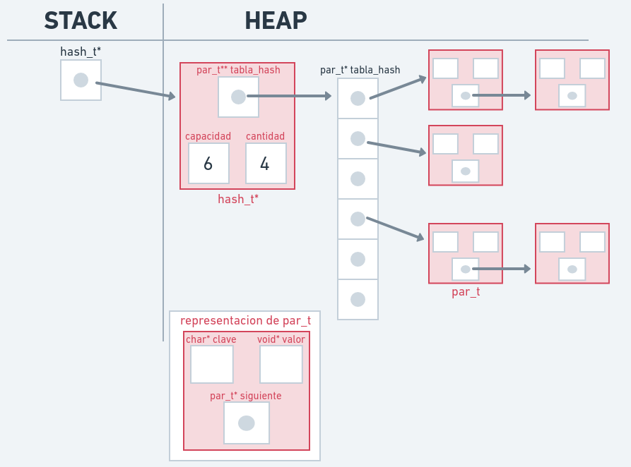
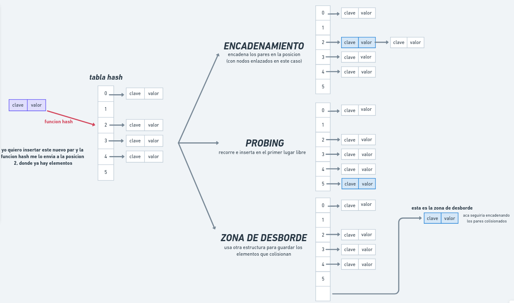

<div align="right">

</div>

# TDA HASH

## Repositorio de Tomas Hevia - 110934 - thevia@fi.uba.ar

- Para compilar:

```bash
make pruebas_chanutron
```

- Para ejecutar:

```bash
./pruebas_chanutron
```

- Para ejecutar con valgrind:
```bash
make valgrind-chanutron
```
---
##  Funcionamiento
En este tda se desarrollaron las estructuras y operaciones para implementar un hash.

las estructuras utilizadas fueron:
```c
typedef struct par{
	void *valor;
	char *clave;
	struct par* siguiente;
}par_t;

struct hash{
	par_t **tabla_hash;
	size_t capacidad;
	size_t cantidad;
};
```

paso a explicar las funciones implementadas:

`hash_crear`: en esta funcion se reserva la memoria necesaria para crear el hash, asignandole la capacidad recibida por parametro (minimo 3 sera la capacidad) y asignando memoria para la tabla hash.

`hash_insertar`: se recibe un hash, una clave, un elemento y un puntero a void* anterior.
esta funcion busca insertar el par clave-elemento dentro del hash.
para esto, se calcula la posicion en la que se insertara el par mediante la `funcion_hash` (uso la djb2).
luego de tener la posicion donde se tiene que insertar, se verifica si esa clave ya se encuentra en esa posicion, si se encuentra se reemplaza el valor, se guarda en anterior el valor que estaba antes y se devuelve el hash.
si la clave no se encuentra en el hash, se crea un nuevo par mediante la funcion `crear_par_nuevo`, el par nuevo contiene una copia de la clave recibida por parametro y el elemento recibido. luego se inserta el nuevo par en la posicion designada (el nuevo par se ubica en el primer elemento de los pares encadenados), se aumenta la cantidad de elementos del hash y se retorna el mismo.
al inicio de esta funcion, se calcula el factor de carga del hash, si este supera el 0.7%, se invoca a la funcion `rehashear`, esta funcion se encarga de crear un nuevo hash con el doble de capacidad que el anterior, e insertar los pares en este nuevo hash, luego el puntero a hash recibido apunta al hash nuevo y se libera la memoria anteriormente usada.

`hash_quitar`: esta funcion recibe un hash y una clave la cual se quiere eliminar del hash.
lo que se hace es, mediante `funcion_hash`, calcular la posicion en la que se deberia encontrar el elemento buscado en la tabla de hash, luego se recorren los pares enlazados en esa posicion, y si se encuentra el par buscado, se lo elimina liberando su memoria y se disminuye la cantidad de elementos del hash, si el elemento no se encuentra luego de recorrer todos los pares, la funcion retornara NULL.

las funciones `hash_obtener` y `hash_contiene` funcionan de la misma manera, con la diferencia de que el par no se elimina del hash y se devuelve el elemento encontrado o NULL en `hash_obtener` y true o false en `hash_contiene`

`hash_cantidad`: devuelve la cantidad de elementos del hash

`hash_destruir_todo`: esta funcion se encarga de liberar toda la memoria del hash. se va recorriendo todo el hash mientras se liberan las claves y los pares, y aparte se destruyen los elementos con la funcion destructora que se recibe por parametro, luego de recorrer todos los pares, se libera la tabla de hash y el hash en si.

`hash_destruir`: se utiliza la funcion `hash_destruir_todo` pero se envia una funcion nula para que no se destruyan los elementos. libera toda la memoria del hash.

`hash_con_cada_clave`: esta funcion itera y recorre todos los pares del hash y les aplica la funcion booleana que recibe por parametro, si la funcion devuelve false, se corta la iteracion.
termina retornando la cantidad de pares a los que se les aplico la funcion booleana.

DIAGRAMA DE MEMORIA DE HASH:
<div align="center">

</div>

---

## Respuestas a las preguntas teóricas

PREGUNTA 1: Que es un diccionario?
Un diccionario es un tipo de dato que, al igual que las listas, arboles y demas tdas que vimos, se utiliza para almacenar datos.
El beneficio, y lo que se busca al implementar este tipo de dato, es su rapidez en la busqueda de los elementos.
Ya que se tiene acceso inmediato a las direcciones de memoria almacenadas en el diccionario.
Los valores se guardan en pares clave-valor, donde la clave es importante para asignarle lugar al par dentro del diccionario, y mediante esa clave se realiza la busqueda del valor en el diccionario.

PREGUNTA 2: Qué es una función de hash y qué características debe tener?
La funcion de hash es una funcion que transforma la clave recibida en un valor numerico, el cual se utiliza para asignar la posicion del par clave-valor en el diccionario. Las caracteristicas que debe tener es que el resultado debe ser mayor que 0 y menor que la capacidad que tiene el diccionario para almacenar elementos, ademas siempre que recibe una clave, esa clave debe retornar el mismo valor numerico.

PREGUNTA 3: Qué es una tabla de Hash y los diferentes métodos de resolución de colisiones vistos (encadenamiento, probing, zona de desborde)?
Una tabla de hash es una estructura que contiene valores (pares clave-valor), estos valores tienen una posicion asignada en la tabla de hash. la tabla guarda los valores junto con la clave, esta clave (a traves de la funcion de hash) sirve para asignar la posicion dentro de la tabla.
La tabla de hash (junto con la funcion hash) permite guardar los valores y acceder a ellos muy facilmente, ya que sabemos la posicion en la que este valor se encuentra, esa es la gran ventaja de los diccionarios.
Puede suceder que varias claves caigan en la misma posicion de la tabla, a esto se lo llama colisiones. Las colisiones se pueden resolver de diferentes formas:

 - Encadenamiento: es la que usamos en esta implementacion. se basa en usar nodos enlazados (o listas, o abb o cualquier estructura) para almacenar los datos que coinciden en esa posicion de la tabla. Dentro de una posicion de la tabla, se encuentran varios pares claves-valor. Osea, cuando se le aplica la funcion hash a una clave, y en la posicion en la que "cae" el par ya hay uno o mas pares asignados, se "encadena" el nuevo par a los pares ya almacenados en esa posicion. Aca la busqueda no va a ser al 100% O(1), ya que puede que tengamos que recorrer algunos elementos hasta encontrarlos, pero aun asi la busqueda sigue siendo muy eficiente.

 - Probing: si al aplicar la funcion hash, el par "cae" en una posicion ya ocupada, lo que se hace es recorrer la tabla de hash hasta encontrar la siguiente ubicacion vacia y ahi se guarda el nuevo par (se lo llama probing lineal), tambien se podria usa un probing cuadratico o usando una segunda funcion de hash buscando otra ubicacion.

 - Zona de desborde: cuando la posicion esta ocupada, el elemento va a la zona de desborde, esta puede ser un vector, una lista, etc. Osea que si se busca el elemento y no se lo encuentra en la posicion, se va a la zona de desborde a buscarlo linealmente.

DIAGRAMA DE FUNCION HASH, TABLA DE HASH y COLISIONES
<div align="center">

</div>


